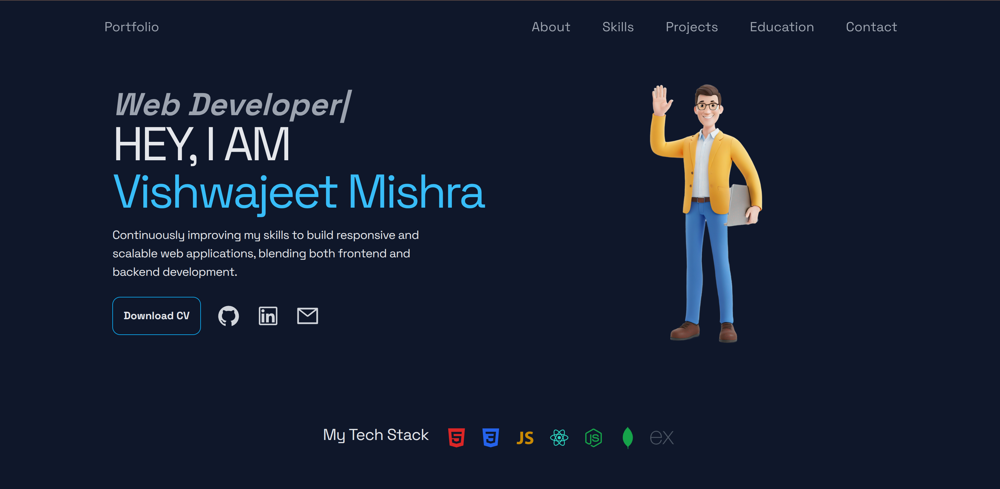

# 🧑‍💻 React Portfolio Website

A **personal portfolio website** built using **React.js** and **Tailwind CSS** to showcase my projects, skills, and contact information. Designed for responsiveness, performance, and a modern UI/UX experience.

## 🚀 Features

- 👋 Personal introduction & about section
- 🛠️ Skills display with icons and categories
- 💼 Projects section with live demos and GitHub links
- 📬 Contact form or contact details section
- 🌗 Optional dark/light theme toggle
- 📱 Fully responsive design across all screen sizes

## 🛠️ Tech Stack

- React.js (Vite)
- Tailwind CSS

## 🖼️ Screenshots



## 📁 Project Structure

```
portfolio-react/
├── public/
│   └── index.html
│   └── favicon.ico
│   └── screenshot.png
├── src/
│   ├── components/
│   ├── assets/
│   ├── App.jsx
│   ── index.js
├── tailwind.config.js
├── package.json
├── postcss.config.js
├── vite.config.js
└── README.md
```

## 📦 Installation

# 1. Clone the repository

git clone https://github.com/Vishwajeeet/Portfolio.git
cd portfolio

# 2. Install dependencies

npm install

# 3. Start the development server

npm run dev

# 4. Build for production

npm run build

## 🌐 Live Preview

[Visit Live Portfolio](https://portfolio-eta-roan-25.vercel.app/)

## ✨ Author

- Made with ❤️ by [Vishwajeet Mishra](https://github.com/Vishwajeeet)
